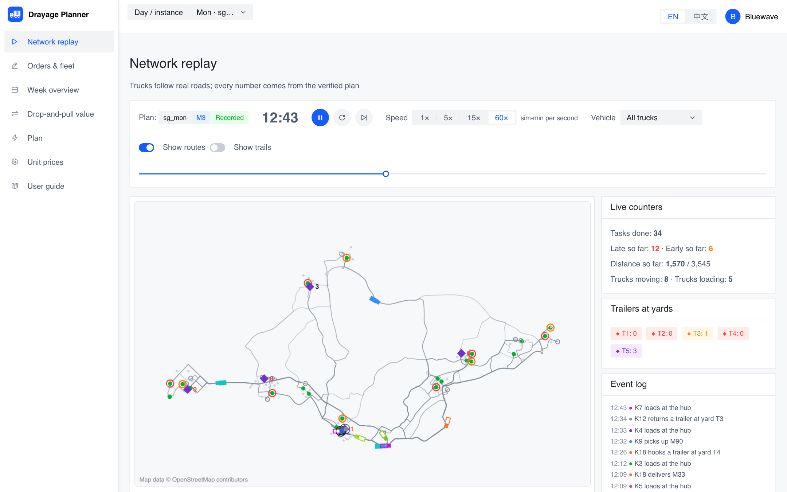
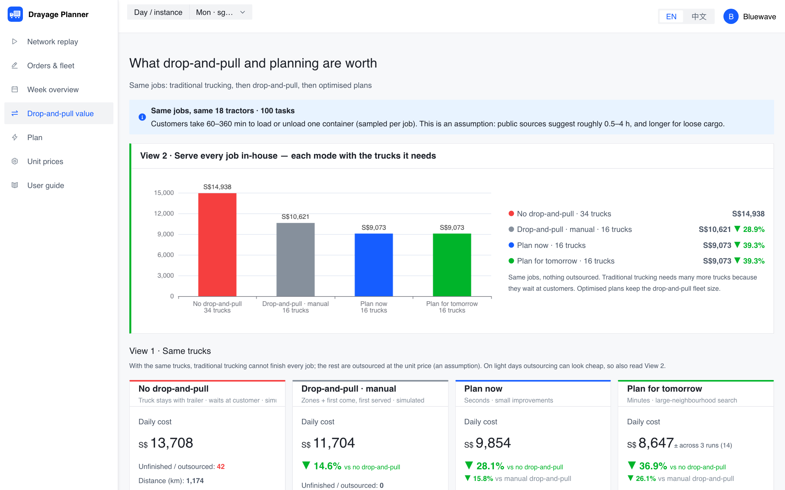
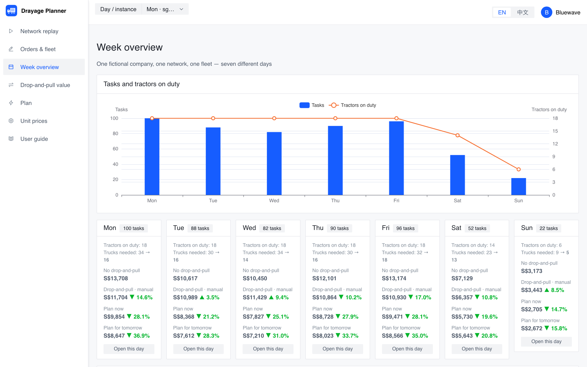
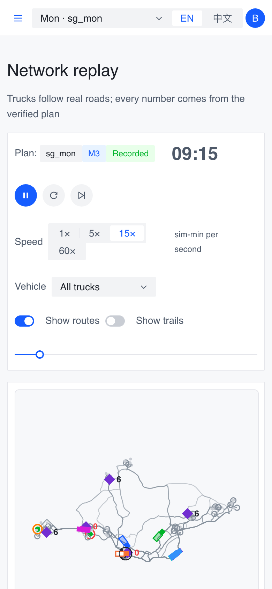

<p align="center"></p>

# Drayage Planner


**[Live demo →](https://drayage-demo.innerdrivestudio.com)** &nbsp;·&nbsp; English / 中文 switch at the top right &nbsp;·&nbsp; works on phones

A decision-support demo for **container drayage**: how much does *drop-and-pull* (leaving the trailer at the customer and moving on) save compared with trucks that wait at the customer — and how much more can optimisation save on top of that?

The same orders, the same trucks and the same price table are run through four operating modes, every plan is re-played by one independent verifier, and the result is shown in money first. Trucks drive along the **real road network of Singapore** (OpenStreetMap, direction-aware distances).



> The company (*Bluewave Drayage Co.*), its customers, volumes and unit prices are **fictional**. Money is in SGD and depends on assumed prices that you can edit in the app.

---

## What you can do in the demo

| | |
|---|---|
| **Network replay** (landing page) | A recorded plan plays on the map the moment you open the app: trucks on real roads, trailer state, yard inventory, event log, single-truck mode. |
| **Drop-and-pull value** | Four-step story line — traditional → drop-and-pull with manual-style rules → plan now (seconds) → plan for tomorrow (minutes) — shown as two views: each mode with the trucks it needs, and the same number of trucks. |
| **Week overview** | One company, one network, seven different days. |
| **Orders & fleet** | Edit the day's jobs and fleet, save "my scenario", compare it live. |
| **Plan** | Run *plan now* or *plan for tomorrow* on any day; open ready-made recorded plans instantly. |
| **Unit prices** | Edit fuel, driver, tractor, outsourcing and penalty prices; every money figure is recomputed from them. |



<p align="center"> </p>

---

## What this demonstrates

- **Money first.** Operating drivers (km, driver hours, trucks used, penalty minutes, outsourced jobs) are converted to money by one editable price table; the front end never recomputes a number.
- **One independent verifier.** Every method outputs only "which truck does what, in which order". Feasibility and all metrics come from a single verifier, so no method grades itself. The animation is generated from the verified plan and agrees with the verifier's totals.
- **Fair comparison.** Same orders, same price table, only one thing changed at a time. Because outsourcing prices can swing a fixed-fleet comparison, results are also shown as "each mode with the trucks it needs".
- **Exact methods as a ruler.** CP-SAT solves small slices to proven optimality and tells how far the heuristics are from optimal; it is not used for the full-size day.
- **Guard rails against gaming the price table.** Tests check that outsourcing a job always costs more than serving it, so an optimiser cannot look cheap by dropping work.
- **Real roads, directed.** Distances and route geometry come from OSM + OSRM and keep one-way streets; points are snapped to roads.
- **Product surface.** Bilingual UI, user guide, input page, recorded plans that open instantly, responsive layout.

---

## Methods

| Method | What it is | Used for |
|---|---|---|
| Traditional | The tractor never leaves its trailer; it waits at the customer | Baseline |
| Manual-style dispatch | Zones by nearest yard, first come first served, fixed morning headcount — rules are transparent and not tuned | Baseline |
| Urgency rule / nearest-task rule | Classic dispatch rules under the real-time inventory convention | Baselines |
| **Plan now** | Local search (relocate / swap across trucks) | Seconds |
| **Plan for tomorrow** | ALNS (destroy: random / worst / related; repair: greedy / regret-2; simulated-annealing acceptance; final polish) | Minutes |
| Exact slices | CP-SAT on 8–10 jobs | Measuring the gap |

Honest note: on a tight fleet the ALNS plan can tie the local-search plan (see Monday in the compare page). A tie is reported as a tie.

---

## Architecture

```
orders + fleet + price table
        │
        ▼
  load instance ──► solver (any method) ──► verifier (feasibility + metrics) ──► cost (drivers × prices)
                                                   │
                                                   ▼
                                          trajectory (per truck, along real roads) ──► replay
```

More in [`docs/architecture.md`](docs/architecture.md).

---

## Quickstart

```bash
git clone https://github.com/juanita-cao/container-truck-vrp-demo.git
cd container-truck-vrp-demo
python -m venv .venv && source .venv/bin/activate
pip install -r requirements.txt

DATASET=demo_sg uvicorn backend.api.main:app --port 8000      # API
cd frontend && npm ci && npm run dev                          # UI on http://localhost:5173

python -m pytest tests -q                                     # backend tests
cd frontend && npm test                                       # front-end tests
```

Python 3.11+. The API needs no external service: road geometry is precomputed in `data/company/`, and recorded plans are in `data/recorded_runs/` (regenerate with `python scripts/record_demo_runs.py`).

## Deploy

`render.yaml` describes a Render setup (API web service + static front end). Environment variables worth knowing:

| Variable | Meaning |
|---|---|
| `CORS_ORIGINS` | The front-end origin allowed to call the API |
| `VITE_API_BASE` | (front end, build time) the API base URL, e.g. `https://…/api` |
| `MAX_CONCURRENT_JOBS`, `MAX_BUDGET_S` | Protect a public demo: one solve at a time, capped run time |

---

## Project structure

```
backend/      solvers, verifier, execution engine, cost model, trajectory, FastAPI
frontend/     React + Vite + TypeScript + Arco Design (EN/中文)
data/         fictional company network + real-road geometry, seven demo days, recorded plans
outputs/      precomputed comparison results behind the week and compare pages
scripts/      network build (OSM/OSRM), plan recording
tests/        backend tests (frontend tests live in frontend/src)
docs/         architecture notes and screenshots
```

## Current scope

Implemented: the pages above, six dispatch/optimisation methods, independent verifier, real-road replay, price-table editing, recorded plans, bilingual and mobile layout.

Not implemented: a sensitivity curve for customer handling time (the drop-and-pull advantage depends strongly on it), replay of the traditional mode, simulation under random disruption, in-day re-planning, new customers on the map, real authentication.

Prices, volumes and the handling-time range are assumptions; results are demo-grade (few seeds, short budgets), not a benchmark.

Map data © OpenStreetMap contributors.
